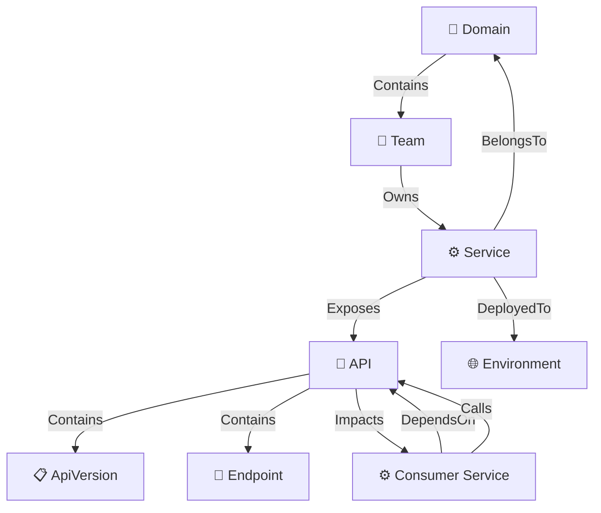

# Engineering Graph — Módulo de Catálogo Relacional e Topologia

> **Bounded Context:** Catalog · **Camadas:** Domain / Application / Infrastructure
> **Namespace raiz:** `NexTraceOne.Catalog.Domain.Graph`, `NexTraceOne.Catalog.Application.Graph`, `NexTraceOne.Catalog.Infrastructure.Graph`

---

## Índice

1. [Visão Geral](#1-visão-geral)
2. [Arquitetura](#2-arquitetura)
3. [Modelo do Grafo](#3-modelo-do-grafo)
4. [Entidades de Domínio](#4-entidades-de-domínio)
5. [Dependências: Declaradas vs Importadas vs Observadas vs Inferidas](#5-dependências-declaradas-vs-importadas-vs-observadas-vs-inferidas)
6. [Provenance / Freshness / Confidence](#6-provenance--freshness--confidence)
7. [Impact Propagation / Blast Radius](#7-impact-propagation--blast-radius)
8. [Subgrafo Contextual (Mini-Graphs)](#8-subgrafo-contextual-mini-graphs)
9. [Temporalidade](#9-temporalidade)
10. [Overlays](#10-overlays)
11. [Integração com OpenTelemetry](#11-integração-com-opentelemetry)
12. [Contexto para IA Investigativa (AI-Ready)](#12-contexto-para-ia-investigativa-ai-ready)
13. [Segurança e Permissões](#13-segurança-e-permissões)
14. [API Endpoints](#14-api-endpoints)
15. [Integração Externa](#15-integração-externa)
16. [SQL Seeds para Desenvolvimento](#16-sql-seeds-para-desenvolvimento)
17. [Testes](#17-testes)
18. [Frontend](#18-frontend)

---

## 1. Visão Geral

O **Engineering Graph** é o núcleo de catálogo relacional, topologia e contexto de impacto da plataforma NexTraceOne. Modela o landscape tecnológico da organização como um **grafo direcionado** de serviços, APIs, consumidores, domínios, equipes e ambientes — com rastreabilidade completa da origem de cada relacionamento.

### O que o módulo resolve

| Pergunta de negócio | Capacidade correspondente |
|---|---|
| *Quais serviços consomem esta API?* | Mapeamento de consumidores (diretos e transitivos) |
| *Se eu alterar esta API, quem será impactado?* | Blast Radius / Impact Propagation |
| *De onde veio esta informação de dependência?* | Provenance com DiscoverySource e confidenceScore |
| *Como o landscape mudou nos últimos 30 dias?* | Snapshots temporais e diff |
| *Quais APIs estão com problemas operacionais?* | Overlays de Health, Risk, ObservabilityDebt |
| *Qual é a saúde geral do meu ecossistema?* | Overlay multidimensional com scores 0–1 |

### Características-chave

- **Grafo relacional tipado** com 7 tipos de nó e 8 tipos de aresta
- **Provenance completa** — toda aresta rastreia origem, confiança e timestamps
- **Blast Radius** — propagação recursiva com profundidade configurável (1–10 níveis)
- **Mini-Graphs** — subgrafos contextuais para sidebars, workflows e releases
- **Temporalidade** — snapshots materializados com diff entre estados
- **6 modos de overlay** — Health, ChangeVelocity, Risk, Cost, ObservabilityDebt
- **Integração externa** — batch sync idempotente para gateways, service meshes e catálogos
- **Inferência OpenTelemetry** — descoberta automática de dependências via telemetria
- **AI-Ready** — topologia release-aware e investigation context packs

---

## 2. Arquitetura

O Engineering Graph pertence ao bounded context **Catalog**, que consolida três subdomínios: **EngineeringGraph**, **Contracts** e **DeveloperPortal**.

```
src/modules/catalog/
├── NexTraceOne.Catalog.Domain/Graph/          ← Entidades, enums, portas, erros
├── NexTraceOne.Catalog.Application/Graph/     ← 21+ features CQRS (VSA)
└── NexTraceOne.Catalog.Infrastructure/Graph/  ← Repositórios, DbContext, endpoints, migrações
```

### Diagrama de camadas

```
┌─────────────────────────────────────────────────────────────────┐
│                        API Endpoints                            │
│              (Minimal API via EndpointModule)                    │
├─────────────────────────────────────────────────────────────────┤
│                    Application Layer                             │
│          Commands / Queries / Validators / Handlers             │
│                  (MediatR + FluentValidation)                   │
├─────────────────────────────────────────────────────────────────┤
│                      Domain Layer                                │
│     Aggregates · Entities · Value Objects · Domain Events        │
│           Enums · Portas (interfaces) · Erros                   │
├─────────────────────────────────────────────────────────────────┤
│                  Infrastructure Layer                            │
│    EF Core DbContext · Repositories · Configurations            │
│            Migrações · ServiceInterfaces impl                   │
└─────────────────────────────────────────────────────────────────┘
```

### Dependências entre contextos

```
ChangeGovernance ───────► Catalog (via IEngineeringGraphModule)
                          │
                          ├── ApiAssetExistsAsync()
                          └── ServiceAssetExistsAsync()
```

O módulo **nunca** acessa diretamente o DbContext de outros bounded contexts. A comunicação cross-module acontece exclusivamente via:

- **ServiceInterfaces** (`IEngineeringGraphModule`) — consultas síncronas
- **Integration Events** (Outbox Pattern) — notificações assíncronas

---

## 3. Modelo do Grafo

### 3.1 Tipos de Nós (`NodeType`)

Cada nó do grafo representa um artefato do landscape tecnológico.

| Valor | Nome | Descrição | Exemplo |
|:---:|---|---|---|
| 0 | `Domain` | Agrupamento por domínio de negócio | Payments, Identity, Orders |
| 1 | `Team` | Equipe responsável | Team Alpha, Platform Squad |
| 2 | `Service` | Microsserviço ou módulo monolítico | payment-gateway, auth-service |
| 3 | `Api` | API publicada (nó central do grafo) | Payments API v2.1.0 |
| 4 | `ApiVersion` | Versão específica (vinculada a contrato/release) | v2.1.0, v3.0.0-beta |
| 5 | `Endpoint` | Endpoint individual de uma API | POST /payments, GET /refunds |
| 6 | `Environment` | Ambiente de execução | Production, Staging, Development |

### 3.2 Tipos de Arestas (`EdgeType`)

As arestas são **direcionadas** e expressam a relação semântica entre dois nós.

| Valor | Nome | Direção | Descrição |
|:---:|---|---|---|
| 0 | `Owns` | A → B | A possui B (Team→Service, Service→API) |
| 1 | `Contains` | A → B | A contém B (Domain→Team, Service→Endpoint) |
| 2 | `DependsOn` | A → B | A depende de B (design-time ou runtime) |
| 3 | `Calls` | A → B | A chama B em runtime (via OpenTelemetry) |
| 4 | `Exposes` | A → B | A expõe B (Service→API, API→Endpoint) |
| 5 | `DeployedTo` | A → B | A está implantado em B (Service→Environment) |
| 6 | `Impacts` | A → B | Mudança em A impacta B (propagação de blast radius) |
| 7 | `BelongsTo` | A → B | A pertence a B (Service→Domain) |

### 3.3 Semântica Relacional (`RelationshipSemantic`)

Indica a **origem** da relação — fundamental para distinguir confiança e acionabilidade.

| Valor | Nome | Descrição |
|:---:|---|---|
| 0 | `Explicit` | Registrada manualmente por um engenheiro via endpoint ou UI |
| 1 | `Inferred` | Descoberta via OpenTelemetry, logs ou análise estática |
| 2 | `Calculated` | Derivada de outros dados do grafo (transitiva) |

### 3.4 Diagrama do modelo relacional



---

## 4. Entidades de Domínio

### 4.1 Mapa de entidades

```
┌──────────────────────────────────────────────────────────┐
│                    ApiAsset (Aggregate Root)               │
│  ┌─────────────────┐  ┌──────────────────────────────┐   │
│  │ DiscoverySource  │  │   ConsumerRelationship        │   │
│  │  · sourceType    │  │   · consumerName              │   │
│  │  · externalRef   │  │   · sourceType                │   │
│  │  · confidence    │  │   · confidenceScore           │   │
│  │  · discoveredAt  │  │   · firstObservedAt           │   │
│  └─────────────────┘  │   · lastObservedAt            │   │
│                        └──────────────────────────────────┘   │
├──────────────────────────────────────────────────────────┤
│  ServiceAsset          ConsumerAsset                      │
│  · name, domain        · name, kind, environment          │
│  · teamName                                               │
├──────────────────────────────────────────────────────────┤
│  GraphSnapshot         NodeHealthRecord    SavedGraphView  │
│  · nodesJson/edgesJson · overlayMode       · filtersJson   │
│  · nodeCount/edgeCount · score (0–1)       · isShared      │
│  · capturedAt          · factorsJson       · ownerId       │
└──────────────────────────────────────────────────────────┘
```

### 4.2 ApiAsset — Aggregate Root

A entidade central do grafo. Representa uma API publicada por um serviço, com todos os seus consumidores e fontes de descoberta.

| Propriedade | Tipo | Descrição |
|---|---|---|
| `Id` | `ApiAssetId` | Identificador strongly-typed |
| `Name` | `string` | Nome único da API |
| `RoutePattern` | `string` | Padrão de rota (ex: `/api/v2/payments`) |
| `Version` | `string` | Versão semântica atual |
| `Visibility` | `string` | `Internal` ou `Public` |
| `OwnerService` | `ServiceAsset` | Serviço proprietário |
| `ConsumerRelationships` | `IReadOnlyList` | Relacionamentos com consumidores |
| `DiscoverySources` | `IReadOnlyList` | Fontes de descoberta |
| `IsDecommissioned` | `bool` | Indica se a API foi descomissionada |

**Operações do aggregate:**

| Método | Retorno | Descrição |
|---|---|---|
| `Register(...)` | `ApiAsset` | Factory method — cria nova API com validação |
| `AddDiscoverySource(source)` | `Result<Unit>` | Adiciona fonte de descoberta com dedup |
| `MapConsumerRelationship(consumer, source, observedAt)` | `Result<ConsumerRelationship>` | Cria ou atualiza relacionamento de consumo |
| `InferDependencyFromOtel(...)` | `Result<ConsumerRelationship>` | Infere dependência via telemetria |
| `ValidateDiscoveredDependency(id, minConfidence)` | `Result<ConsumerRelationship>` | Valida se confiança atinge limiar |
| `UpdateMetadata(...)` | `Result<Unit>` | Atualiza nome, rota, versão, visibilidade |
| `Decommission()` | `Result<Unit>` | Marca como descomissionada (impede novos mapeamentos) |

### 4.3 ServiceAsset

Representa um microsserviço, monolito ou módulo que publica APIs.

| Propriedade | Tipo | Descrição |
|---|---|---|
| `Id` | `ServiceAssetId` | Identificador strongly-typed |
| `Name` | `string` | Nome único do serviço |
| `Domain` | `string` | Domínio de negócio (Payments, Identity, etc.) |
| `TeamName` | `string` | Equipe responsável |

### 4.4 ConsumerAsset

Representa um consumidor de APIs — pode ser serviço, job, lambda ou outro tipo de componente.

| Propriedade | Tipo | Descrição |
|---|---|---|
| `Id` | `ConsumerAssetId` | Identificador strongly-typed |
| `Name` | `string` | Nome do serviço consumidor |
| `Kind` | `string` | Tipo: `Service`, `Job`, `Lambda` |
| `Environment` | `string` | Ambiente: `Production`, `Staging`, `Development` |

### 4.5 ConsumerRelationship

Materializa a dependência entre um consumidor e uma API, com rastreabilidade temporal e de confiança.

| Propriedade | Tipo | Descrição |
|---|---|---|
| `Id` | `ConsumerRelationshipId` | Identificador strongly-typed |
| `ConsumerAssetId` | `ConsumerAssetId` | Referência ao consumidor |
| `ConsumerName` | `string` | Nome do consumidor (desnormalizado para consultas) |
| `SourceType` | `string` | `Manual`, `OpenTelemetry`, `CatalogImport` |
| `ConfidenceScore` | `decimal` | Score de confiança (0.0–1.0) |
| `FirstObservedAt` | `DateTimeOffset` | Primeira observação da dependência |
| `LastObservedAt` | `DateTimeOffset` | Última confirmação da dependência |

### 4.6 DiscoverySource

Rastreia como uma API ou dependência foi descoberta.

| Propriedade | Tipo | Descrição |
|---|---|---|
| `Id` | `DiscoverySourceId` | Identificador strongly-typed |
| `SourceType` | `string` | `Manual`, `OpenTelemetry`, `CatalogImport` |
| `ExternalReference` | `string` | Referência no sistema externo |
| `DiscoveredAt` | `DateTimeOffset` | Momento da descoberta |
| `ConfidenceScore` | `decimal` | Confiança na fonte (0.0–1.0) |

### 4.7 GraphSnapshot

Materialização temporal do estado completo do grafo — permite comparação histórica.

| Propriedade | Tipo | Descrição |
|---|---|---|
| `Id` | `GraphSnapshotId` | Identificador strongly-typed |
| `Label` | `string` | Rótulo descritivo (ex: `"Pre-release v2.1"`) |
| `CapturedAt` | `DateTimeOffset` | Momento da captura |
| `NodesJson` | `string` | Estado serializado dos nós |
| `EdgesJson` | `string` | Estado serializado das arestas |
| `NodeCount` | `int` | Contagem rápida sem deserialização |
| `EdgeCount` | `int` | Contagem rápida sem deserialização |
| `CreatedBy` | `string` | Identificação do criador (auditoria) |

### 4.8 NodeHealthRecord

Registo de saúde de um nó para visualização via overlays.

| Propriedade | Tipo | Descrição |
|---|---|---|
| `Id` | `NodeHealthRecordId` | Identificador strongly-typed |
| `NodeId` | `Guid` | Referência genérica ao nó |
| `NodeType` | `NodeType` | Tipo do nó (Service, Api, etc.) |
| `OverlayMode` | `OverlayMode` | Dimensão de análise |
| `Status` | `HealthStatus` | Estado: Healthy, Degraded, Unhealthy, Unknown |
| `Score` | `decimal` | Score normalizado (0.0–1.0) |
| `FactorsJson` | `string` | Fatores explicativos em JSON |
| `CalculatedAt` | `DateTimeOffset` | Momento do cálculo |
| `SourceSystem` | `string` | Sistema que calculou (RuntimeIntelligence, etc.) |

### 4.9 SavedGraphView

Visualização personalizada e persistida do grafo — filtros, overlay e foco.

| Propriedade | Tipo | Descrição |
|---|---|---|
| `Id` | `SavedGraphViewId` | Identificador strongly-typed |
| `Name` | `string` | Nome da visualização |
| `Description` | `string` | Descrição opcional |
| `OwnerId` | `string` | ID do utilizador criador |
| `IsShared` | `bool` | Se é visível para outros utilizadores |
| `FiltersJson` | `string` | Configuração completa de filtros para replay |
| `CreatedAt` | `DateTimeOffset` | Momento de criação |

### 4.10 Strongly-Typed IDs

Todas as entidades utilizam identificadores fortemente tipados para evitar erros de atribuição e melhorar a legibilidade:

| ID | Entidade |
|---|---|
| `ApiAssetId` | ApiAsset |
| `ServiceAssetId` | ServiceAsset |
| `ConsumerAssetId` | ConsumerAsset |
| `ConsumerRelationshipId` | ConsumerRelationship |
| `DiscoverySourceId` | DiscoverySource |
| `GraphSnapshotId` | GraphSnapshot |
| `NodeHealthRecordId` | NodeHealthRecord |
| `SavedGraphViewId` | SavedGraphView |

---

## 5. Dependências: Declaradas vs Importadas vs Observadas vs Inferidas

O Engineering Graph distingue quatro origens de dependência, cada uma com nível de confiança e tratamento diferente.

```
                    ┌─────────────────────────┐
                    │     ConsumerRelationship │
                    │   sourceType + confidence│
                    └────────┬────────────────┘
            ┌────────────────┼────────────────┬───────────────┐
            ▼                ▼                ▼               ▼
     ┌──────────┐    ┌──────────────┐  ┌──────────┐   ┌──────────┐
     │ Declarada│    │  Importada   │  │ Observada│   │ Inferida │
     │  Manual  │    │ CatalogImport│  │   OTel   │   │Calculada │
     │ conf=1.0 │    │ conf=0.8-0.9 │  │conf=0.6-1│   │conf=0.3-0.7│
     └──────────┘    └──────────────┘  └──────────┘   └──────────┘
```

### 5.1 Declaradas (Manual)

- **Origem:** Registradas por um engenheiro via endpoint `POST /apis/{id}/consumers` ou UI
- **SourceType:** `Manual`
- **Confiança:** 1.0 (máxima — decisão humana explícita)
- **RelationshipSemantic:** `Explicit`
- **Caso de uso:** Equipa registra que o serviço X consome a API Y

### 5.2 Importadas (CatalogImport)

- **Origem:** Sincronizadas de catálogos externos via `POST /integration/v1/consumers/sync`
- **SourceType:** `CatalogImport`
- **Confiança:** 0.8–0.9 (depende da qualidade do catálogo externo)
- **RelationshipSemantic:** `Explicit`
- **Fontes suportadas:** Backstage, Kong Gateway, Apigee, ServiceNow CMDB
- **Caso de uso:** Importação em lote de dependências de um API Gateway

### 5.3 Observadas (OpenTelemetry)

- **Origem:** Inferidas a partir de sinais de telemetria em runtime
- **SourceType:** `OpenTelemetry`
- **Confiança:** 0.6–1.0 (depende do volume e consistência dos traces)
- **RelationshipSemantic:** `Inferred`
- **Caso de uso:** OpenTelemetry detecta que o serviço A chama a API B em produção

### 5.4 Inferidas (Calculated)

- **Origem:** Derivadas por análise transitiva ou heurísticas sobre o grafo
- **SourceType:** Calculado internamente
- **Confiança:** 0.3–0.7 (dependendo da profundidade e qualidade dos dados base)
- **RelationshipSemantic:** `Calculated`
- **Caso de uso:** Se A→B e B→C, o sistema infere que mudanças em C podem impactar A

---

## 6. Provenance / Freshness / Confidence

### 6.1 Modelo de rastreabilidade

Cada dependência no grafo carrega **provenance completa** — a origem dos dados, quando foram observados e com que nível de confiança.

```
┌───────────────────────────────────────────────────────────┐
│               ConsumerRelationship                         │
│                                                           │
│  sourceType ─────────► "Manual" | "OpenTelemetry" | ...   │
│  confidenceScore ────► 0.0 – 1.0                         │
│  firstObservedAt ────► 2025-01-15T10:30:00Z               │
│  lastObservedAt ─────► 2025-06-10T14:22:00Z               │
│                                                           │
│  ┌─────────────────────────────────────────────────────┐  │
│  │             DiscoverySource                          │  │
│  │  sourceType ──────► "KongGateway"                   │  │
│  │  externalReference ► "kong://route/payment-v2"      │  │
│  │  confidenceScore ──► 0.85                           │  │
│  │  discoveredAt ─────► 2025-06-10T14:22:00Z           │  │
│  └─────────────────────────────────────────────────────┘  │
└───────────────────────────────────────────────────────────┘
```

### 6.2 Freshness (Frescura dos dados)

| Campo | Significado |
|---|---|
| `firstObservedAt` | Quando a dependência foi detectada pela primeira vez |
| `lastObservedAt` | Última vez que a dependência foi confirmada (refresh) |
| `DiscoverySource.discoveredAt` | Momento exato da descoberta por uma fonte específica |

A diferença entre `lastObservedAt` e o momento atual indica a **frescura** da informação. Dependências não confirmadas há muito tempo podem ser stale e merecem investigação.

### 6.3 Confidence Score

| Faixa | Classificação | Ação recomendada |
|:---:|---|---|
| 0.9–1.0 | 🟢 Alta | Confiável para decisões de blast radius |
| 0.7–0.89 | 🟡 Média | Usar com cautela, validar se possível |
| 0.5–0.69 | 🟠 Baixa | Requer validação manual antes de usar em aprovações |
| 0.01–0.49 | 🔴 Muito baixa | Apenas informativo, não usar para decisões |

O método `ValidateDiscoveredDependency` permite validar se uma dependência inferida atinge um limiar mínimo de confiança antes de ser considerada nas análises de impacto.

---

## 7. Impact Propagation / Blast Radius

### 7.1 Conceito

O **Blast Radius** responde à pergunta fundamental: *"Se eu alterar esta API, quem será impactado?"*

O módulo realiza um **traversal recursivo** do grafo a partir de um nó raiz, seguindo as arestas de consumo em profundidade configurável.

### 7.2 Algoritmo

```
Entrada: rootNodeId, maxDepth (1–10)
Saída:   lista de nós impactados agrupados por profundidade

1. Buscar ApiAsset pelo rootNodeId
2. Inicializar conjunto visitados = {rootNodeId}
3. Para cada profundidade d de 1 até maxDepth:
   a. Para cada nó na fronteira atual:
      - Buscar consumidores diretos (ConsumerRelationships)
      - Para cada consumidor não visitado:
        · Adicionar ao conjunto visitados
        · Adicionar à lista de impactados[d]
        · Adicionar à próxima fronteira
4. Retornar breakdown por profundidade + totais
```

### 7.3 Resposta

```json
{
  "rootNodeId": "550e8400-e29b-41d4-a716-446655440000",
  "rootNodeName": "Payments API v2.1.0",
  "maxDepth": 3,
  "directConsumersCount": 4,
  "transitiveConsumersCount": 7,
  "totalImpactedCount": 11,
  "impactedNodes": [
    {
      "depth": 1,
      "nodeId": "...",
      "nodeName": "mobile-app",
      "nodeType": "Service",
      "relationship": "DependsOn"
    },
    {
      "depth": 2,
      "nodeId": "...",
      "nodeName": "notification-service",
      "nodeType": "Service",
      "relationship": "Calls"
    }
  ]
}
```

### 7.4 Integração com ChangeGovernance

O bounded context **ChangeGovernance** consome o blast radius para:

- Calcular o **Change Intelligence Score** (peso do impacto na pontuação de risco)
- Determinar aprovadores obrigatórios (owners dos serviços impactados)
- Gerar o **Evidence Pack** para auditoria de releases

---

## 8. Subgrafo Contextual (Mini-Graphs)

### 8.1 Conceito

O **Subgraph** extrai um grafo focado em torno de um nó raiz, ideal para visualizações em contexto limitado: sidebars de release, painéis de workflow, investigação de incidentes.

### 8.2 Parâmetros

| Parâmetro | Tipo | Default | Limite | Descrição |
|---|---|---|---|---|
| `rootNodeId` | `Guid` | — | — | Nó central do subgrafo |
| `maxDepth` | `int` | 2 | 1–5 | Profundidade máxima de traversal |
| `maxNodes` | `int` | 50 | 1–200 | Número máximo de nós retornados |

### 8.3 Comportamento

```
┌─────────────────────────────────────────────────────┐
│              Subgrafo (depth=2, maxNodes=50)          │
│                                                     │
│                ┌──────────┐                         │
│         ┌─────►│ Consumer │                         │
│         │      │   A      │                         │
│  ┌──────┴───┐  └──────────┘                         │
│  │   API    │                                       │
│  │  (root)  ├──────────────►┌──────────┐            │
│  │          │               │ Consumer │            │
│  └──────┬───┘  ┌──────────┐│   B      │            │
│         │      │ Owner    │└──────────┘            │
│         └─────►│ Service  │                         │
│                └──────────┘                         │
│                                                     │
│  isTruncated: false                                 │
└─────────────────────────────────────────────────────┘
```

- Suporta nós raiz do tipo **Service** e **Api**
- Coleta nós e arestas separadamente para renderização flexível
- Campo `isTruncated` indica se o limite de nós foi atingido
- Previne ciclos via conjunto de nós visitados

### 8.4 Casos de uso

| Contexto | maxDepth | maxNodes | Uso |
|---|---|---|---|
| Sidebar de release | 1 | 20 | Consumidores diretos da API alterada |
| Painel de workflow | 2 | 50 | Contexto de impacto para aprovadores |
| Investigação de incidente | 3 | 100 | Grafo expandido para root cause analysis |
| Relatório de blast radius | 2 | 50 | Evidence pack para auditoria |

---

## 9. Temporalidade

### 9.1 Snapshots do Grafo

O módulo permite **materializar** o estado completo do grafo em um momento específico, criando snapshots que podem ser comparados posteriormente.

```
Timeline:
─────┬───────────────┬───────────────┬───────────────►
     │               │               │
  Snapshot 1      Snapshot 2      Snapshot 3
  "Baseline"     "Post-Release"   "Current"
  (10 nós,       (12 nós,         (15 nós,
   14 arestas)    18 arestas)      22 arestas)
```

### 9.2 Criação de Snapshots

| Endpoint | `POST /api/v1/engineeringgraph/snapshots` |
|---|---|
| **Trigger** | Manual (via UI ou API) ou automático (pré/pós-release) |
| **Conteúdo** | Serialização JSON de todos os nós e arestas |
| **Metadata** | Label, CreatedBy, NodeCount, EdgeCount |

### 9.3 Comparação Temporal (GetTemporalDiff)

Compara dois snapshots e retorna as diferenças:

| Endpoint | `GET /api/v1/engineeringgraph/snapshots/diff?baselineId=...&currentId=...` |
|---|---|

**Tipos de diferença detectados:**

| Tipo | Descrição |
|---|---|
| `NodeAdded` | Nó presente no snapshot atual mas ausente no baseline |
| `NodeRemoved` | Nó presente no baseline mas ausente no atual |
| `EdgeAdded` | Aresta adicionada entre snapshots |
| `EdgeRemoved` | Aresta removida entre snapshots |

### 9.4 Relação com Releases e Deployments

Os snapshots criam **marcadores temporais** que permitem correlacionar mudanças no landscape com eventos de release:

```
Release v2.1.0 ────► Snapshot "Pre-release v2.1"
    │
    │ Deploy
    │
    ▼
Produção ──────────► Snapshot "Post-release v2.1"
    │
    │ Diff = +2 APIs, +5 consumidores, -1 serviço
    ▼
Evidence Pack
```

---

## 10. Overlays

### 10.1 Modos de Overlay (`OverlayMode`)

Os overlays projetam **dimensões analíticas** sobre o grafo, colorindo nós e arestas com base em métricas operacionais.

| Valor | Nome | Descrição | Fonte Típica |
|:---:|---|---|---|
| 0 | `None` | Visualização padrão sem overlay | — |
| 1 | `Health` | Saúde operacional (deploys, incidentes, SLA) | RuntimeIntelligence |
| 2 | `ChangeVelocity` | Frequência de releases/deploys | ChangeIntelligence |
| 3 | `Risk` | Score composto: breaking changes + blast radius + tech debt | ChangeIntelligence |
| 4 | `Cost` | Estimativa de custo operacional/infraestrutura | OperationalIntelligence |
| 5 | `ObservabilityDebt` | Lacunas em tracing, métricas, logs, alertas | OperationalIntelligence |

### 10.2 Health Status (`HealthStatus`)

| Valor | Nome | Cor sugerida | Descrição |
|:---:|---|---|---|
| 0 | `Healthy` | 🟢 Verde | Operação normal, sem incidentes |
| 1 | `Degraded` | 🟡 Amarelo | Alertas ativos ou desempenho abaixo do esperado |
| 2 | `Unhealthy` | 🔴 Vermelho | Incidentes ativos ou deploys falhados |
| 3 | `Unknown` | ⚪ Cinza | Dados insuficientes para avaliação |

### 10.3 NodeHealthRecord — Explicabilidade

Cada registo de saúde inclui um campo `FactorsJson` que detalha os fatores que contribuíram para o score:

```json
{
  "factors": [
    { "name": "deploy_success_rate", "value": 0.95, "weight": 0.3 },
    { "name": "active_incidents", "value": 0, "weight": 0.25 },
    { "name": "sla_compliance", "value": 0.99, "weight": 0.25 },
    { "name": "error_rate_7d", "value": 0.02, "weight": 0.2 }
  ],
  "calculatedScore": 0.92,
  "calculatedStatus": "Healthy"
}
```

Isto permite que a UI mostre não apenas o score final, mas também os **fatores individuais** que o compõem — essencial para investigação e tomada de decisão.

---

## 11. Integração com OpenTelemetry

### 11.1 Arquitetura de dados

```
┌─────────────────┐     ┌──────────────────────┐     ┌──────────────────┐
│  Aplicações     │     │  Telemetry Store      │     │  Product Store   │
│  instrumentadas │────►│  (Tempo / Loki)       │────►│  (PostgreSQL)    │
│  com OTel SDK   │     │  Dados brutos         │     │  Dados agregados │
└─────────────────┘     └──────────────────────┘     └────────┬─────────┘
                                                              │
                                                              ▼
                                                    ┌──────────────────┐
                                                    │ Engineering Graph│
                                                    │ InferDependency  │
                                                    │ FromOtel         │
                                                    └──────────────────┘
```

### 11.2 Separação de responsabilidades

| Camada | Armazena | Usado por |
|---|---|---|
| **Telemetry Store** (Tempo/Loki) | Traces, spans, logs brutos | Investigação / debug |
| **Product Store** (PostgreSQL) | Dependências agregadas, métricas sumarizadas | Engineering Graph |

> **Regra fundamental:** O Engineering Graph **nunca** consulta o Telemetry Store diretamente. Consome apenas dados **agregados** no Product Store (PostgreSQL).

### 11.3 Feature: InferDependencyFromOtel

Cria ou atualiza uma `ConsumerRelationship` a partir de sinais de telemetria:

| Parâmetro | Descrição |
|---|---|
| `consumerName` | Nome do serviço chamador (extraído do span) |
| `environment` | Ambiente de execução |
| `externalReference` | Referência ao trace/span de origem |
| `confidenceScore` | Confiança baseada no volume e consistência |
| `observedAt` | Timestamp da observação |

### 11.4 Readiness para métricas runtime

O modelo está preparado para consumir métricas agregadas que alimentam os overlays:

- **req/min** — volume de requisições por minuto
- **throughput** — bytes/s transferidos
- **latência** — p50, p95, p99
- **error rate** — taxa de erros por período

Estas métricas são calculadas no módulo **OperationalIntelligence** e projetadas no grafo via `NodeHealthRecord`.

---

## 12. Contexto para IA Investigativa (AI-Ready)

O Engineering Graph foi desenhado para servir como **fonte de contexto topológico** para a IA investigativa do módulo **AIKnowledge**.

### 12.1 Topologia Release-Aware

Cada nó do grafo pode ser correlacionado com releases e deployments, permitindo que a IA contextualize:

- *"Esta API teve 3 releases nos últimos 7 dias"*
- *"O serviço consumidor foi afetado por uma breaking change na versão anterior"*

### 12.2 Arestas Operation-Aware

As arestas `Calls` (runtime) carregam informação sobre padrões de comunicação real, não apenas design-time:

- Volume de chamadas por período
- Latência observada
- Taxa de erro na comunicação

### 12.3 Investigation Context Packs

O subgrafo contextual pode ser empacotado como **investigation context** para a IA:

```json
{
  "focusNode": { "id": "...", "name": "Payments API", "type": "Api" },
  "topology": {
    "directConsumers": ["mobile-app", "web-portal"],
    "ownerService": "payment-gateway",
    "ownerTeam": "Team Alpha",
    "domain": "Payments"
  },
  "recentChanges": ["v2.0.0 → v2.1.0 (breaking)"],
  "healthOverlay": { "score": 0.65, "status": "Degraded" }
}
```

### 12.4 Drift Detection

Comparação entre o grafo **modelado** (declarado/importado) e o grafo **observado** (OpenTelemetry):

| Cenário | Significado |
|---|---|
| Dependência declarada mas não observada | API pode estar desatualizada ou não utilizada |
| Dependência observada mas não declarada | Shadow dependency — risco de impacto não previsto |
| Confiança a degradar ao longo do tempo | Dependência pode ter sido removida silenciosamente |

---

## 13. Segurança e Permissões

### 13.1 Permissões

| Permissão | Operações |
|---|---|
| `engineering-graph:assets:read` | Consultar grafo, subgrafos, impacto, snapshots, overlays, views |
| `engineering-graph:assets:write` | Registar serviços/APIs, mapear consumidores, criar snapshots, gerir views |

### 13.2 Tenant Scoping

- Todas as operações são executadas no contexto do tenant do utilizador autenticado
- O `EngineeringGraphDbContext` aplica **Row-Level Security (RLS)** automática via interceptor
- Não é possível consultar ou modificar dados de outro tenant

### 13.3 Environment Scoping

- Consumidores são contextualizados por ambiente (`Production`, `Staging`, `Development`)
- O blast radius pode ser filtrado por ambiente para análise direcionada
- Snapshots capturam o estado de todos os ambientes

### 13.4 Integração com IdentityAccess

```
Requisição HTTP
    │
    ▼
JWT Bearer Token ──► Extração de TenantId + UserId + Permissions
    │
    ▼
RequirePermission("engineering-graph:assets:read")
    │
    ▼
Handler executa no contexto do tenant
```

---

## 14. API Endpoints

**Base:** `/api/v1/engineeringgraph`

| # | Método | Rota | Feature | Descrição |
|:---:|:---:|---|---|---|
| 1 | `POST` | `/services` | RegisterServiceAsset | Regista novo serviço |
| 2 | `POST` | `/apis` | RegisterApiAsset | Regista nova API com serviço proprietário |
| 3 | `GET` | `/graph` | GetAssetGraph | Grafo completo de APIs, serviços e consumidores |
| 4 | `GET` | `/apis/{apiAssetId}` | GetAssetDetail | Detalhe de uma API com consumidores e fontes |
| 5 | `GET` | `/apis/search?term=...` | SearchAssets | Pesquisa por nome ou padrão de rota |
| 6 | `POST` | `/apis/{apiAssetId}/consumers` | MapConsumerRelationship | Mapeia consumidor para uma API |
| 7 | `GET` | `/subgraph/{rootNodeId}` | GetSubgraph | Subgrafo contextual com profundidade e limite |
| 8 | `GET` | `/impact/{rootNodeId}` | GetImpactPropagation | Blast radius com breakdown por profundidade |
| 9 | `POST` | `/snapshots` | CreateGraphSnapshot | Materializa estado atual do grafo |
| 10 | `GET` | `/snapshots` | ListSnapshots | Lista snapshots com paginação |
| 11 | `GET` | `/snapshots/diff` | GetTemporalDiff | Compara dois snapshots (baseline vs current) |
| 12 | `GET` | `/health` | GetNodeHealth | Scores e status por overlay mode |
| 13 | `POST` | `/views` | CreateSavedView | Persiste visualização personalizada |
| 14 | `GET` | `/views` | ListSavedViews | Lista views próprias e partilhadas |
| 15 | `POST` | `/integration/v1/consumers/sync` | SyncConsumers | Batch upsert de consumidores externos |

---

## 15. Integração Externa

### 15.1 SyncConsumers — Batch Upsert

Endpoint principal para integração com sistemas externos (API Gateways, Service Meshes, Catálogos).

| Aspecto | Detalhe |
|---|---|
| **Endpoint** | `POST /api/v1/engineeringgraph/integration/v1/consumers/sync` |
| **Autenticação** | JWT Bearer com tenant scoping |
| **Limite por batch** | 100 itens |
| **Idempotência** | Chave composta: `ApiAssetId + ConsumerName + SourceType` |
| **Tratamento de erros** | Por item — falha em um não bloqueia os restantes |
| **Transação** | Commit único ao final do batch |

**Exemplo de request:**

```json
{
  "sourceSystem": "KongGateway",
  "correlationId": "abc-123",
  "items": [
    {
      "apiAssetId": "550e8400-e29b-41d4-a716-446655440000",
      "consumerName": "mobile-app",
      "consumerKind": "Service",
      "consumerEnvironment": "Production",
      "externalReference": "kong://consumers/mobile-app",
      "confidenceScore": 0.85
    }
  ]
}
```

**Exemplo de response:**

```json
{
  "results": [
    {
      "apiAssetId": "550e8400-e29b-41d4-a716-446655440000",
      "consumerName": "mobile-app",
      "outcome": "Created"
    }
  ],
  "totalProcessed": 1,
  "created": 1,
  "updated": 0,
  "failed": 0
}
```

### 15.2 Fontes externas suportadas

| Sistema | sourceSystem | Descrição |
|---|---|---|
| Kong Gateway | `KongGateway` | API Gateway com discovery de consumers |
| Istio Service Mesh | `IstioServiceMesh` | Service mesh com telemetria de tráfego |
| Backstage | `BackstageCatalog` | Catálogo de serviços Spotify Backstage |
| Apigee | `ApigeeGateway` | Google Apigee API Management |
| ServiceNow | `ServiceNowCMDB` | CMDB para mapeamento de dependências |
| AWS API Gateway | `AWSApiGateway` | API Gateway da AWS |

### 15.3 Códigos de erro

| Código | Descrição |
|---|---|
| `EngineeringGraph.ApiAsset.NotFound` | API referenciada não existe no catálogo |
| `EngineeringGraph.ApiAsset.Decommissioned` | API foi descomissionada — novos mapeamentos bloqueados |

> 📖 Documentação completa da API de integração: [`EXTERNAL-INTEGRATION-API.md`](./EXTERNAL-INTEGRATION-API.md)

---

## 16. SQL Seeds para Desenvolvimento

Os scripts de seed em `database/seeds/engineering-graph/` criam um cenário realista para desenvolvimento e testes manuais.

### 16.1 Scripts disponíveis

| Ordem | Ficheiro | Conteúdo |
|:---:|---|---|
| 00 | `00-reset-engineering-graph-test-data.sql` | Limpa dados de teste (idempotente) |
| 01 | `01-seed-services.sql` | 8 serviços em 3 domínios |
| 02 | `02-seed-apis.sql` | 12 APIs com versões semânticas |
| 03 | `03-seed-consumers.sql` | Consumidores: mobile-app, web-portal, api-gateway |
| 04 | `04-seed-consumer-relationships.sql` | 17 relacionamentos com scores de confiança |
| 05 | `05-seed-discovery-sources.sql` | Fontes de descoberta associadas |
| 06 | `06-seed-snapshots.sql` | 3 snapshots temporais (Baseline, Post-Release, Current) |
| 07 | `07-seed-node-health.sql` | Métricas de saúde por overlay |
| 08 | `08-seed-saved-views.sql` | Visualizações guardadas de exemplo |

### 16.2 Cenário modelado

```
Domínio Payments:
  ├── payment-gateway ──► Payments API v2.1.0
  │                       Refunds API v1.2.0
  ├── payment-processor ─► Processing API v3.0.0
  └── payment-reconciliation ─► Reconciliation API v1.0.0

Domínio Identity:
  ├── auth-service ──────► Auth API v2.0.0
  └── user-management ───► Users API v1.5.0

Domínio Orders:
  ├── order-orchestrator ► Orders API v2.0.0
  └── catalog-service ───► Catalog API v1.1.0
      notification-service ► Notifications API v1.0.0

Consumidores:
  mobile-app ────► Payments API, Auth API, Orders API
  web-portal ────► Payments API, Users API, Catalog API
  api-gateway ───► Auth API, Processing API
```

### 16.3 Como executar

```bash
# Executar todos os seeds em ordem
for f in database/seeds/engineering-graph/*.sql; do
  psql -h localhost -U nextraceone -d nextraceone -f "$f"
done
```

---

## 17. Testes

### 17.1 Localização

```
tests/modules/catalog/NexTraceOne.Catalog.Tests/Graph/
└── Application/Features/
    └── EngineeringGraphApplicationTests.cs
```

### 17.2 Cenários cobertos

| Teste | Cenário |
|---|---|
| `RegisterServiceAsset_Should_ReturnResponse_When_ServiceIsNew` | Registo de serviço válido |
| `RegisterServiceAsset_Should_ReturnConflict_When_ServiceAlreadyExists` | Conflito em nome duplicado |
| `RegisterApiAsset_Should_ReturnResponse_When_InputIsValid` | Registo de API com serviço proprietário válido |
| `RegisterApiAsset_Should_ReturnNotFound_When_OwnerServiceDoesNotExist` | Rejeição quando serviço proprietário não existe |
| `RegisterApiAsset_Should_ReturnConflict_When_ApiAlreadyExists` | Conflito em nome+proprietário duplicado |
| `MapConsumerRelationship_Should_ReturnResponse_When_ApiAssetExists` | Mapeamento de consumidor válido |
| `MapConsumerRelationship_Should_ReturnNotFound_When_ApiAssetDoesNotExist` | Rejeição quando API não existe |
| `GetAssetGraph_Should_ReturnGraphResponse_With_ServicesAndApis` | Consulta do grafo completo |

### 17.3 Execução

```bash
# Executar apenas testes do Engineering Graph
dotnet test tests/modules/catalog/NexTraceOne.Catalog.Tests/ \
  --filter "FullyQualifiedName~EngineeringGraph"

# Executar todos os testes do bounded context Catalog
dotnet test tests/modules/catalog/NexTraceOne.Catalog.Tests/
```

### 17.4 Cobertura

Os testes cobrem as camadas de **domínio** (invariantes dos aggregates) e **aplicação** (handlers CQRS com mocks dos repositórios). Testes de integração com PostgreSQL e testes end-to-end com Playwright estão planeados para fases posteriores.

---

## 18. Frontend

### 18.1 Ficheiros principais

| Ficheiro | Descrição |
|---|---|
| `src/frontend/src/features/catalog/pages/EngineeringGraphPage.tsx` | Página principal com sistema de abas |
| `src/frontend/src/features/catalog/api/engineeringGraph.ts` | Client HTTP (13 funções) |
| `src/frontend/src/__tests__/pages/EngineeringGraphPage.test.tsx` | Testes da página |

### 18.2 Abas da página principal

| Aba | Conteúdo |
|---|---|
| **Services** | Lista de serviços com domínio e equipa; formulário de registo |
| **APIs** | Lista de APIs com versão, visibilidade e proprietário; formulário de registo |
| **Graph** | Visualização do grafo relacional com nós e arestas |
| **Impact Analysis** | Cálculo de blast radius a partir de um nó raiz |
| **Temporal Diff** | Comparação entre dois snapshots temporais |

### 18.3 Visualização

- **Nós de serviço:** cor azul (`bg-blue-100`)
- **Nós de API:** cor esmeralda (`bg-emerald-100`)
- **Badges de confiança:** gradiente de cores baseado no score
  - 🔴 `< 0.5` — danger
  - 🟠 `0.5–0.69` — warning
  - 🟡 `0.7–0.89` — info
  - 🟢 `≥ 0.9` — success

### 18.4 i18n

O frontend utiliza internacionalização em 4 idiomas, com chaves organizadas por namespace:

```
catalog.graph.title
catalog.graph.tabs.services
catalog.graph.tabs.apis
catalog.graph.tabs.graph
catalog.graph.tabs.impact
catalog.graph.tabs.temporal
catalog.graph.register_service
catalog.graph.register_api
catalog.graph.blast_radius
catalog.graph.confidence_score
```

---

## Referências

| Documento | Caminho |
|---|---|
| API de Integração Externa | [`docs/engineering-graph/EXTERNAL-INTEGRATION-API.md`](./EXTERNAL-INTEGRATION-API.md) |
| Roadmap do Módulo | [`docs/engineering-graph/ROADMAP.md`](./ROADMAP.md) |
| Arquitetura Geral | [`docs/ARCHITECTURE.md`](../ARCHITECTURE.md) |
| Convenções de Código | [`docs/CONVENTIONS.md`](../CONVENTIONS.md) |
| Domínio de Negócio | [`docs/DOMAIN.md`](../DOMAIN.md) |
| Segurança | [`docs/SECURITY.md`](../SECURITY.md) |
